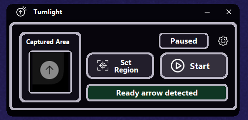
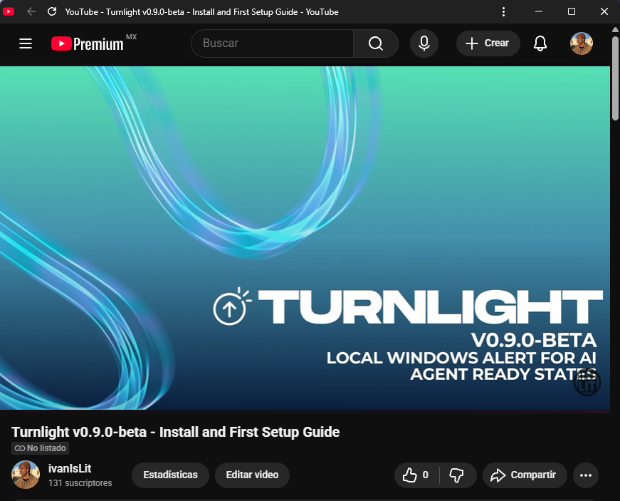
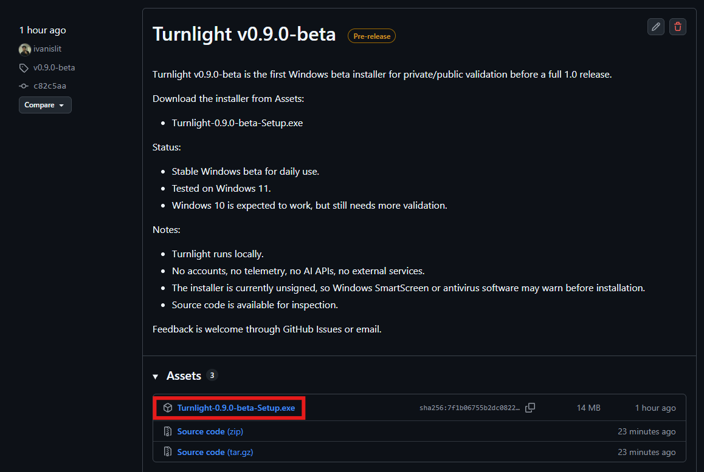
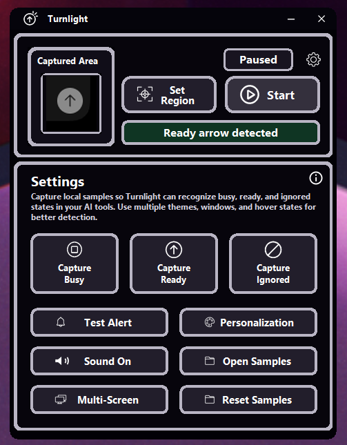
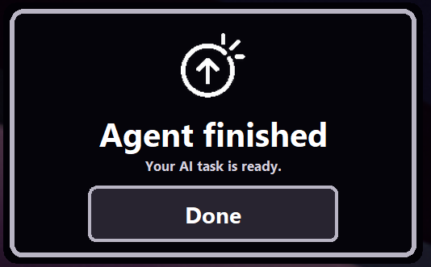
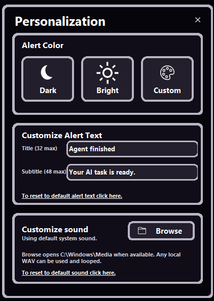
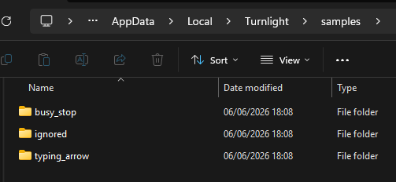

# Turnlight

Turnlight is a local Windows utility that watches a small screen region and shows a large visual alert when an AI agent appears to be ready again.

The core logic is intentionally simple:

```text
busy/stop state -> ready/send state -> alert
```

Turnlight has one job: detect a stable transition from busy to ready, then get your attention.



## Video Guide

The easiest way to install and configure Turnlight for the first time is the short setup video:

[](https://youtu.be/7Bi66-juU_4?si=NbXpIjXAjl7A94eM)

[Turnlight v0.9.0-beta - Install and First Setup Guide](https://youtu.be/7Bi66-juU_4?si=NbXpIjXAjl7A94eM)

Chapters:

- `0:00` Downloading and running the installer
- `0:56` Setting up Turnlight detection with local samples
- `2:15` Compatibility with Always On Top (Microsoft PowerToys)
- `2:25` Settings
- `2:54` Personalization
- `3:52` Thanks

## Why Turnlight Exists

Long-running AI agent sessions make it easy to lose focus by checking the screen over and over. Turnlight lets you step away from constant monitoring without missing the moment when the agent is ready for the next prompt.

It is built for AI agent power users, developers, designers, and anyone who runs long AI tasks while doing something else nearby.

The original idea came from multi-monitor setups where the AI tool is not running on the main monitor. It can also be useful on a single-monitor setup if you often step away for brief moments while an agent is working.

The practical goal is simple: maximize focus without losing the ability to keep working, planning future prompts, doing design work, or briefly stepping away from the desk while the agent runs.

## Status

Current version: `v0.9.0-beta`

Turnlight is a stable Windows beta for daily use, but it is still being validated on more Windows setups before a `v1.0.0` release.

Tested:

- Windows 11

Expected but not fully verified yet:

- Windows 10

## Download

Download the latest beta installer from GitHub Releases:

[Turnlight v0.9.0-beta](https://github.com/ivanislit/turnlight/releases/tag/v0.9.0-beta)

Installer:

```text
Turnlight-0.9.0-beta-Setup.exe
```



The installer does not require Python to be installed on the target PC.

## Windows SmartScreen And Antivirus

Turnlight is currently unsigned. Because of that, Windows SmartScreen or antivirus software may warn before installation.

This is common for new independent Windows apps, especially beta installers with low reputation. You are encouraged to inspect the source code before installing. The project is intentionally small and simple: it watches pixels from a screen region, compares them to local samples, and displays a local alert.

See [SmartScreen and antivirus notes](docs/troubleshooting.md#windows-smartscreen-and-antivirus).

## First Setup

If this is your first time using Turnlight, the [video guide](https://youtu.be/7Bi66-juU_4?si=NbXpIjXAjl7A94eM) is the easiest way to follow the setup visually.

1. Open Turnlight.
2. Click `Set Region`.
3. Select the small screen area that changes between a busy/stop state and a ready/send state.
4. Open `Settings`.
5. Capture several `Busy` samples while the agent is working.
6. Capture several `Ready` samples when the agent is ready for the next message.
7. Capture `Ignored` samples for visual states that should not trigger an alert.
8. Use `Test Alert` to confirm the alert is visible and sound behavior is right for you.
9. Leave Turnlight watching in the background.



Capture samples across the themes, windows, zoom levels, and hover states you actually use. Better samples make detection more reliable.

## Alert

When Turnlight detects the valid transition, it shows a large alert.



The alert can use the default system sound or a custom local WAV file.

## Personalization

Turnlight includes basic personalization:

- Alert color
- Custom alert title and subtitle
- Optional custom WAV sound
- Sound on/off
- Multi-screen or primary-screen alert mode



The alert text and samples are stored locally.

## How It Works

Turnlight compares the pixels from the region you selected with local samples that you captured.

The transition that matters is:

```text
busy_stop stable -> typing_arrow -> alert
```

It does not alert when the UI goes from ready to busy. It only alerts when a previously busy state becomes ready.

The video guide shows this flow with a real AI chat window: set the region, capture local samples, then let Turnlight wait for the busy-to-ready transition.

Turnlight was primarily tested in my personal Codex workflow. It can also work with other AI tools because the logic is based on local visual samples. In practice, the key is selecting the right region and capturing samples that match your actual UI.

## Local Data

Default install location:

```text
%LocalAppData%\Programs\Turnlight
```

Local data folder:

```text
%LocalAppData%\Turnlight
```

Turnlight stores config, logs, status, and samples locally in that data folder.



## Privacy

Turnlight is local-first by design.

- No accounts
- No cloud services
- No telemetry
- No AI APIs
- No external services
- No background server
- No uploaded screenshots

Turnlight captures only the screen region you configure. Samples stay on your machine.

## Documentation

- [Video guide](https://youtu.be/7Bi66-juU_4?si=NbXpIjXAjl7A94eM)
- [Visual walkthrough](docs/walkthrough.md)
- [Troubleshooting](docs/troubleshooting.md)

## Limitations

- Windows only for now.
- Windows 11 has been tested; Windows 10 still needs more validation.
- The installer is unsigned and may trigger SmartScreen or antivirus warnings.
- Detection depends on local samples and the selected region.
- Turnlight only sees visible pixels on your desktop.
- It cannot inspect secure desktops such as UAC prompts or protected screens.
- The watched region should stay inside one physical monitor.

## Install From Source

For development or local source installs:

```powershell
git clone git@github.com:ivanislit/turnlight.git
cd turnlight
.\install.ps1
.\create-desktop-shortcut.ps1
```

Run manually:

```powershell
.\run.ps1
```

Build the Windows installer:

```powershell
.\build.ps1
```

The build uses PyInstaller and Inno Setup.

## Feedback And Contact

Feedback is welcome through GitHub Issues or email.

- GitHub: [github.com/ivanislit](https://github.com/ivanislit/)
- Email: `ivannav.464@gmail.com`

Messages and issues are welcome in English or Spanish.

## Author

Created by `ivanislit`.

In some places I may write it as `ivanIsLit`.

## License

Turnlight is licensed under Apache-2.0. See [LICENSE](LICENSE).

Apache-2.0 is a good fit for Turnlight because it is permissive, standard for open-source software, allows broad reuse, and includes a patent grant while keeping the project simple to adopt.

## Notice

Turnlight is not affiliated with, endorsed by, or sponsored by OpenAI, Anthropic, Cursor, Windsurf, or any AI tool provider. Product names and trademarks belong to their respective owners.
