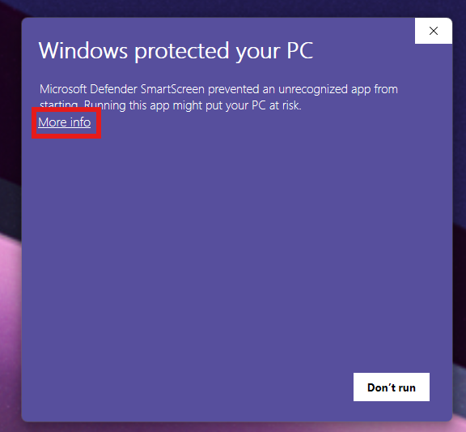
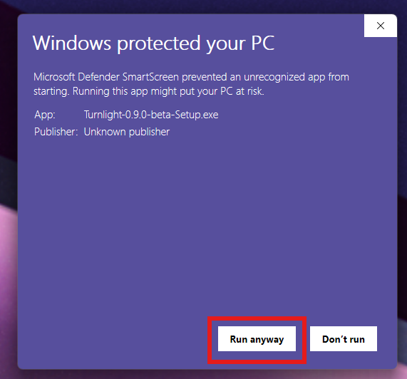

# Troubleshooting

## Windows SmartScreen And Antivirus

Turnlight is currently unsigned. Windows SmartScreen or antivirus software may warn before installation.

This is common for new independent Windows apps, especially beta installers that do not have code-signing reputation yet.

The setup video shows this flow visually:

[Turnlight v0.9.0-beta - Install and First Setup Guide](https://youtu.be/7Bi66-juU_4?si=NbXpIjXAjl7A94eM)

If Windows shows `Windows protected your PC`:

1. Click `More info`.
2. Click `Run anyway`.





You are encouraged to inspect the source code before installing. Turnlight is intentionally small and local:

- It watches pixels from a screen region you select.
- It compares those pixels to local samples.
- It shows a local alert when a busy state becomes ready.
- It does not use accounts, telemetry, cloud services, AI APIs, or external services.

## Turnlight Does Not Alert

Check these first:

- The watched region is correct.
- The region stays inside one physical monitor.
- You have captured `Busy` samples while the agent is working.
- You have captured `Ready` samples when the agent is actually ready.
- You have captured `Ignored` samples for states that should not trigger.
- The UI theme, zoom level, and hover state match your samples.

The valid transition is:

```text
busy_stop stable -> typing_arrow -> alert
```

Turnlight does not alert just because it sees a ready state. It alerts when it first sees a stable busy state and then sees the ready state.

## Turnlight Alerts Too Often

Capture more `Ignored` samples for states that look similar to ready but should not trigger.

Also capture more `Busy` and `Ready` samples across your real UI states:

- Normal state
- Hover state
- Different themes
- Different windows
- Different zoom levels

## Where Data Is Stored

Installed app:

```text
%LocalAppData%\Programs\Turnlight
```

User data:

```text
%LocalAppData%\Turnlight
```

Samples:

```text
%LocalAppData%\Turnlight\samples
```

Logs:

```text
%LocalAppData%\Turnlight\turnlight.log
```

## Uninstall

Uninstalling Turnlight removes the installed app and shortcuts.

User data is intentionally kept in:

```text
%LocalAppData%\Turnlight
```

This preserves config and samples in case you reinstall.
