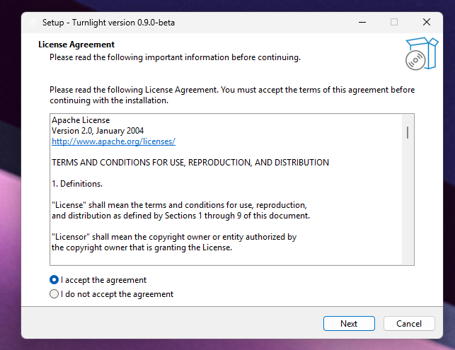
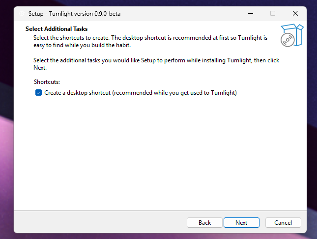
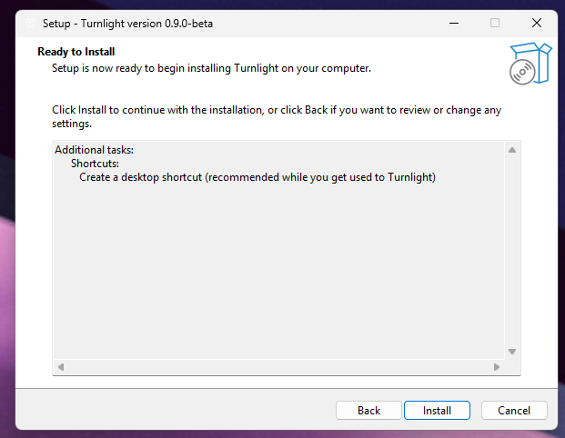

# Turnlight Visual Walkthrough

This walkthrough shows the full beta flow: download, install, first setup, samples, personalization, and alert.

## Video Guide

Watch the short setup video first if you want to see the complete flow in motion:

[](https://youtu.be/7Bi66-juU_4?si=NbXpIjXAjl7A94eM)

[Turnlight v0.9.0-beta - Install and First Setup Guide](https://youtu.be/7Bi66-juU_4?si=NbXpIjXAjl7A94eM)

Chapters:

- `0:00` Downloading and running the installer
- `0:56` Setting up Turnlight detection with local samples
- `2:15` Compatibility with Always On Top (Microsoft PowerToys)
- `2:25` Settings
- `2:54` Personalization
- `3:52` Thanks

## 1. Download The Installer

Open the latest GitHub Release and download the installer from the Assets section.

Installer:

```text
Turnlight-0.9.0-beta-Setup.exe
```


## 2. Run The Installer

Turnlight installs as a normal per-user Windows app.

Default install location:

```text
%LocalAppData%\Programs\Turnlight
```



The desktop shortcut is recommended while you are getting used to the app.



Finish the install.



## 3. SmartScreen Or Antivirus Warning

Turnlight is currently unsigned, so Windows SmartScreen or antivirus software may warn before installation.

This warning is expected for new independent Windows apps without code-signing reputation.

Click `More info`, then `Run anyway` if you trust the source and want to continue.


## 4. First Launch

Open Turnlight from the desktop shortcut or Start Menu.


The compact window shows:

- Captured area preview
- Watching state
- Set Region
- Start/Pause
- Current detection state

## Optional: Keep Turnlight Visible With PowerToys Always On Top

Turnlight works well with Microsoft PowerToys Always On Top. This is especially useful in multi-monitor setups, where you may want Turnlight visible while working across screens.

This workflow inspired the original idea: keeping an eye on long AI tasks without constantly returning to the main chat or editor window.

## 5. Set The Watched Region

Click `Set Region` and select the small area that visually changes between a busy/stop state and a ready/send state.

The region should stay inside one physical monitor.

## 6. Capture Samples

Open Settings and capture local samples:

- `Capture Busy` while the agent is working
- `Capture Ready` when the agent is ready for the next prompt
- `Capture Ignored` for visual states that should not trigger an alert


Turnlight's core logic is:

```text
busy_stop stable -> typing_arrow -> alert
```

It only alerts when a previously busy state becomes ready.

## 7. Check The Samples Folder

Samples are stored locally in:

```text
%LocalAppData%\Turnlight\samples
```


The sample folders are:

- `busy_stop`
- `typing_arrow`
- `ignored`

## 8. Personalize The Alert

Open Personalization to adjust:

- Alert color
- Alert title
- Alert subtitle
- Custom WAV sound


## 9. Test The Alert

Click `Test Alert` in Settings.


If sound is enabled, the sound loops while the alert is active. Click `Done` to close it.

## 10. Let It Watch

Once the region and samples are configured, leave Turnlight watching.

When it sees:

```text
busy -> ready
```

it shows the alert.
